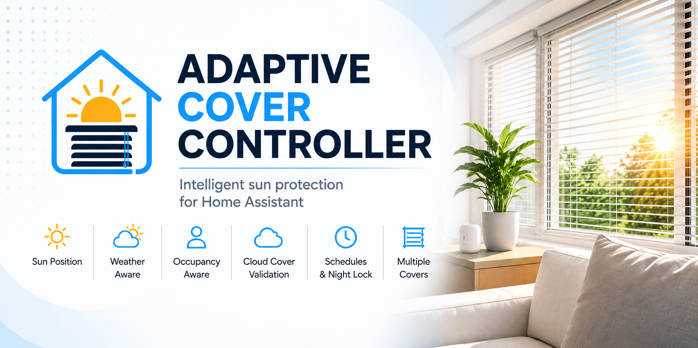
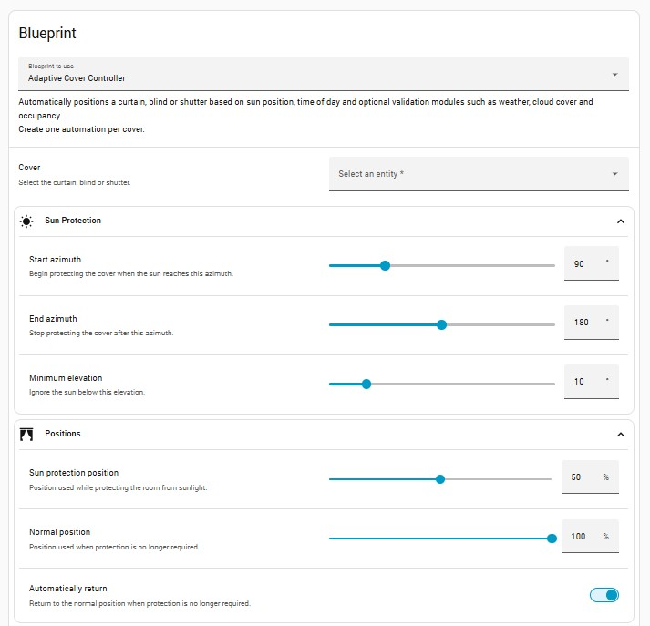
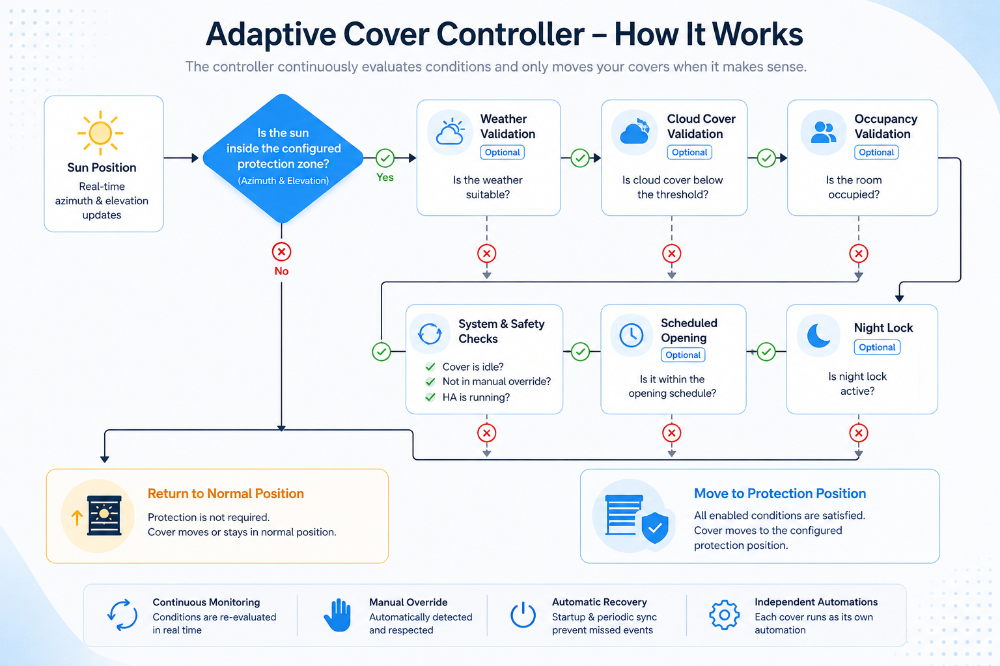

<p align="center">
  
</p>

# Adaptive Cover Controller


Adaptive Cover Controller is a Home Assistant blueprint for automatically controlling curtains, blinds and shutters based on the sun's position.

Protection is determined using the sun's azimuth and elevation, with optional weather, cloud cover, occupancy and schedule validation. Each cover runs as its own automation and can be configured independently.

---

> [!NOTE]
> **AI-assisted development**
>
> This project was developed using AI as an engineering tool - not as a replacement for engineering.
>
> AI assisted with brainstorming, code reviews, documentation and iterative refinement, while all architectural decisions, implementation choices and real-world testing were carried out by the project author.

## Installation

### Import using My Home Assistant (recommended)

[](https://my.home-assistant.io/redirect/blueprint_import/?blueprint_url=https://raw.githubusercontent.com/wgumaa/Adaptive-Cover-Controller/main/blueprint/adaptive_cover_controller.yaml)

### Manual installation

Copy:

```text
adaptive_cover_controller.yaml
```

to:

```text
config/blueprints/automation/
```

Reload Blueprints and create a new automation using **Adaptive Cover Controller**.

---

## Features

- Sun position control using azimuth and elevation
- Optional weather validation
- Optional cloud cover validation with hysteresis
- Optional occupancy validation
- Scheduled opening
- Night lock
- Manual override detection
- Automatic recovery after Home Assistant restarts
- Tilt support for Venetian blinds
- Individual configuration for every cover

---

## Configuration

Each automation controls a single cover.

The blueprint is organised into the following sections:

- Cover
- Sun Protection
- Positions
- Schedule
- Manual Override
- Occupancy
- Weather Validation
- Cloud Cover
- Blind Features
- Advanced

### Manual Override

If Manual Override is enabled, create one Input Select helper for each cover with the following options:

```text
normal
automation
manual
```

Do not share the same helper between multiple covers.

---

## Blueprint

<p align="center">

</p>

---

## How It Works

Adaptive Cover Controller continuously evaluates the sun's position together with any enabled validation modules.

When all configured conditions are satisfied, the cover moves to the configured protection position.

When protection is no longer required, the cover automatically returns to its normal position.

<p align="center">

</p>

To avoid unnecessary movement, commands are only sent when the requested position or tilt differs from the current state.

---

## Requirements

- Home Assistant 2025.7 or later
- One supported cover entity
- One Input Select helper per cover when using Manual Override

---

## License

Released under the MIT License.
