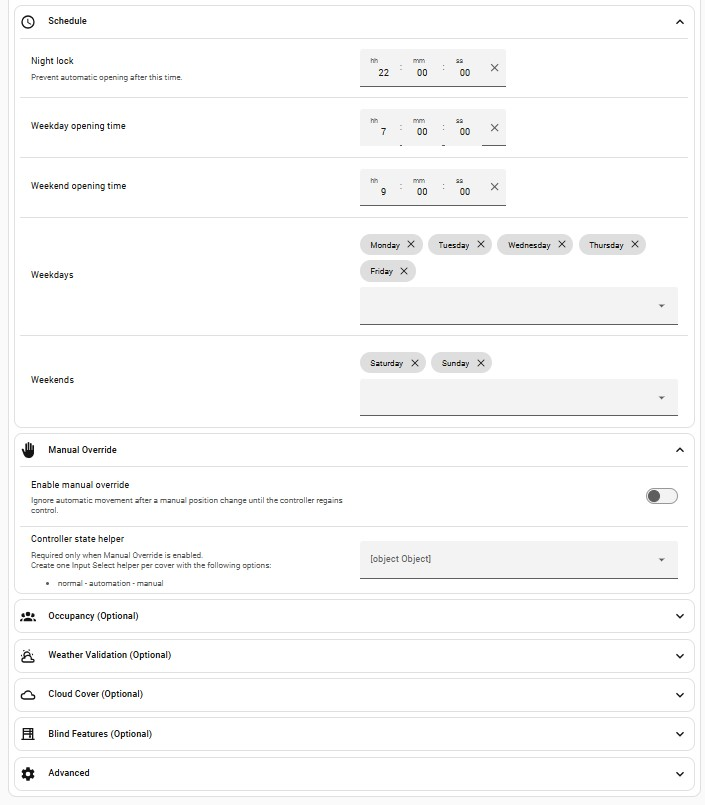

# Adaptive Cover Controller

**Home Assistant:** 2025.7 or newer

An adaptive Home Assistant blueprint that automatically protects curtains,
blinds and shutters from direct sunlight using the sun's position.

The controller uses the sun's azimuth and elevation to determine when a cover
should move to a protection position. Optional validation modules allow the
decision to be refined using weather conditions, cloud cover, occupancy and
time-based schedules.

Each cover is configured as its own automation, allowing different rooms to
have independent protection zones, schedules and behaviour.

## Blueprint

### Main Configuration


### Optional Features



## Features

- Sun azimuth and elevation protection
- Optional weather validation
- Optional cloud cover validation with hysteresis
- Optional occupancy validation
- Night lock
- Scheduled morning opening
- Manual override detection
- Automatic recovery after manual override
- Startup recovery after Home Assistant restart
- Periodic recovery to protect against missed events
- Supports curtains, blinds and shutters

## Installation

### Option 1 – Home Assistant (Recommended)

Click the button below to import the blueprint directly into your Home Assistant instance.

[](https://my.home-assistant.io/redirect/blueprint_import/?blueprint_url=https://raw.githubusercontent.com/wgumaa/Adaptive-Cover-Controller/main/blueprint/adaptive_cover_controller.yaml)

### Option 2 – Manual Installation

1. Download `adaptive_cover_controller.yaml` from the `blueprint` folder.
2. Copy it to:

   ```
   config/blueprints/automation/
   ```

3. Reload Blueprints in Home Assistant.
4. Create a new automation using **Adaptive Cover Controller**.

### Controller Mode Helper

Create one **Input Select** helper for each cover with the following options:

- `normal`
- `automation`
- `manual`

Assign this helper to the blueprint when creating the automation.

> **Note:** Create a separate helper for every cover controlled by the blueprint.

## Requirements

- Home Assistant 2025.7 or newer
- A cover entity (curtain, blind or shutter)
- One Input Select helper per cover (if Manual Override is enabled)

## Configuration

Each automation controls a single cover.

### Required

Configure the following:

- Cover entity
- Controller Mode helper
- Sun azimuth start
- Sun azimuth end
- Protection position

### Required Helper

Create one **Input Select** helper for each cover with the following options:

- `normal`
- `automation`
- `manual`

This helper is used by the blueprint to track whether the cover is operating normally, is being moved by the automation, or has been manually overridden.

> **Important:** Do not reuse the same helper for multiple covers. Each cover must have its own Controller Mode helper.

### Optional Features

The following modules can be enabled independently:

- Weather validation
- Cloud cover validation
- Occupancy validation
- Tilt control
- Night lock
- Scheduled morning opening

This allows each cover to be configured differently depending on its location and requirements.

## Manual Override

The blueprint automatically detects when a cover is moved manually.

When a manual movement is detected:

- The controller enters **Manual** mode.
- Automatic movement is suspended.
- The cover remains under user control.

Automatic operation resumes only after the cover is manually returned to the position currently requested by the controller.

This prevents the automation from repeatedly fighting manual adjustments while still allowing it to resume normal operation when appropriate.

## How It Works

The controller continuously evaluates whether the cover should be protecting the room from direct sunlight.

The decision is based on:

1. Sun azimuth
2. Sun elevation
3. Optional weather validation
4. Optional cloud cover validation
5. Optional occupancy validation
6. Night lock and opening schedule

If all enabled conditions are satisfied, the cover moves to the configured protection position.

If protection is no longer required, the controller automatically returns the cover to its normal position.

To prevent unnecessary commands, movement is only requested when the cover is idle and not already at the desired position. The controller also performs a periodic check and recovers automatically after Home Assistant restarts, ensuring the cover remains synchronized even if an event is missed.

## Example Use Cases

- Close east-facing bedroom curtains during the morning sun.
- Protect west-facing living room blinds during the afternoon.
- Keep office curtains closed only while someone is home.
- Ignore protection when heavy cloud cover is present.
- Automatically reopen covers the following morning.
- Allow manual control at any time without the automation fighting the user.

## License

This project is released under the MIT License.